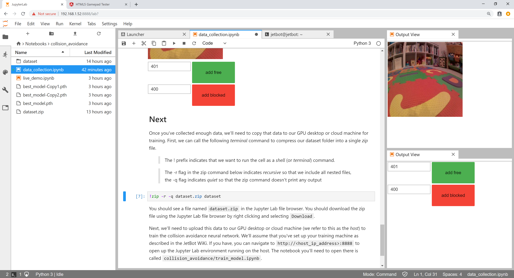
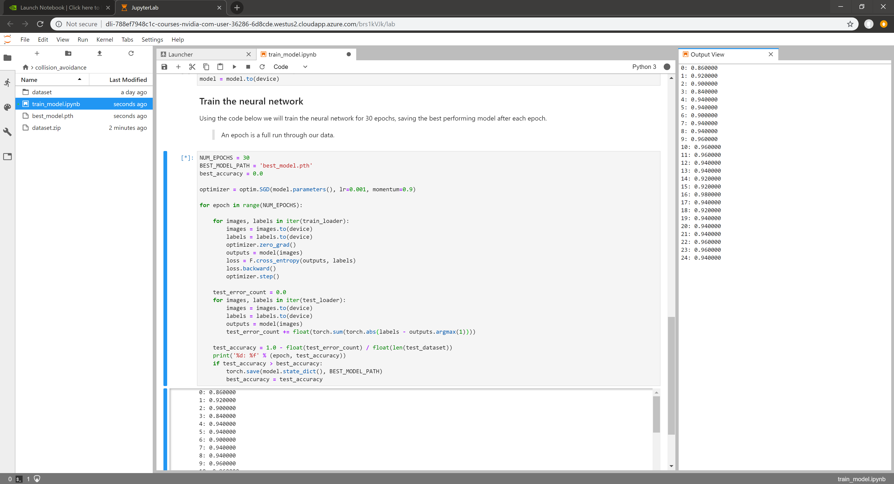
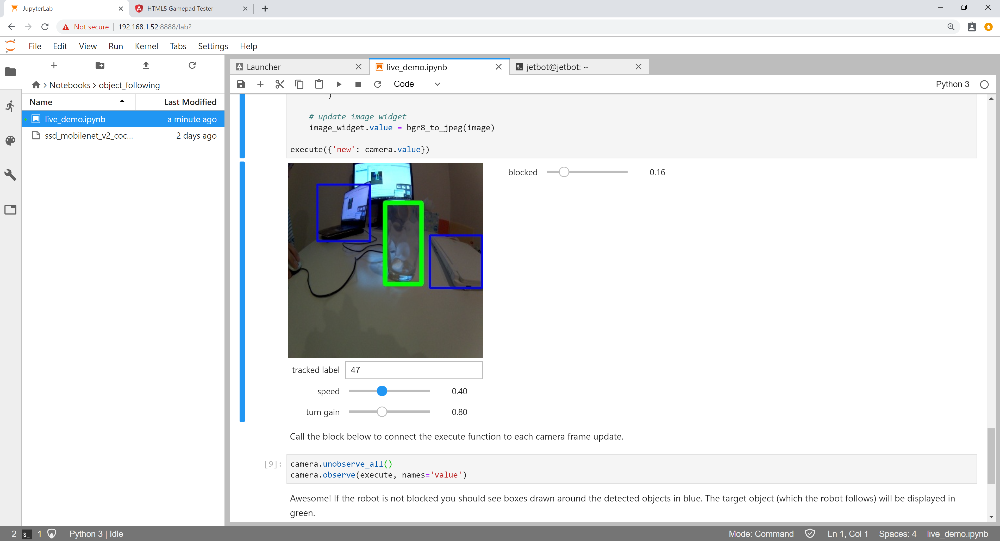

This page lists the examples provided with JetBot

> Make sure your robot is connected to WiFi as described in the [software setup](software-setup)

### Example 1 - Basic Motion

In this example we'll control JetBot by programming from a web browser.

1. Connect to your robot by navigating to ``http://<jetbot_ip_address>:8888``

2. Navigate to ``~/Notebooks/basic_motion/``
3. Open and follow the ``basic_motion.ipynb`` notebook

### Example 2 - Teleoperation

> This example requires a gamepad controller connected to your workstation.

In this example we'll drive JetBot remotely, view live streaming video, and save snapshots!

1. Connect to your robot by navigating to ``http://<jetbot_ip_address>:8888``

2. Shutdown all other running notebooks by selecting ``Kernel`` -> ``Shutdown All Kernels...``
3. Navigate to ``~/Notebooks/teleoperation/``
3. Open and follow the ``teleoperation.ipynb`` notebook

### Example 3 - Collision avoidance

In this example we'll collect an *image classification* dataset that will be used to help keep
JetBot safe!  We'll teach JetBot to detect two scenarios ``free`` and ``blocked``.  We'll use this AI classifier to prevent JetBot from entering dangerous territory.

#### Step 1 - Collect data on JetBot

> We provide a pre-trained model so you can skip to step 3 if desired.

1. Connect to your robot by navigating to ``http://<jetbot_ip_address>:8888``

2. Shutdown all other running notebooks by selecting ``Kernel`` -> ``Shutdown All Kernels...``
3. Navigate to ``~/Notebooks/collision_avoidance/``
4. Open and follow the ``data_collection.ipynb`` notebook

#### Step 2 - Train neural network on cloud

<!---->

1. Navigate to ``https://courses.nvidia.com/dli-event`` in your web browser

2. Enter the event code ``DLI_Jet_Demo``
3. Sign in to your NVIDIA Developer Account if you have not already
4. Select ``View Course`` -> ``Course`` -> ``Click here to begin`` -> ``Start``
5. Wait a few minutes for the cloud training machine to set up
6. Launch the Jupyter Lab by selecting ``Launch Task``
7. In the Jupyter Lab tab, navigate to ``~/collision_avoidance``
8. Open and follow the ``train_model.ipynb`` notebook

#### Step 3 - Run live demo on JetBot

<!---->

1. Connect back to your robot by navigating to ``http://<jetbot_ip_address>:8888``

2. Shutdown all other running notebooks by selecting ``Kernel`` -> ``Shutdown All Kernels...``
3. Navigate to ``~/Notebooks/collision_avoidance``
4. Open and follow the ``live_demo.ipynb`` notebook

#### Video

This video shows multiple JetBots running collision avoidance

### Example 4 - Object Following

In this example we'll have JetBot follow an object using a pre-trained model capable of detecting common objects like``Person``, ``Cup``, and ``Dog``.  While doing this, JetBot will run the collision avoidance model from Example 3 to make sure it stays safe!

1. Connect to your robot by navigating to ``http://<jetbot_ip_address>:8888``

2. Shutdown all other running notebooks by selecting ``Kernel`` -> ``Shutdown All Kernels...``
3. Navigate to ``~/Notebooks/object_following/``
4. Open and follow the ``live_demo.ipynb`` notebook

#### Video

This video shows JetBot following a person and avoiding obstacles

## Next

Make JetBot smarter

* Collect more collision avoidance data
* Try out different neural network architectures (the [torchvision](https://pytorch.org/docs/stable/torchvision/models.html) package has lots!)
* Modify the collision avoidance example for a new task (ie: ``cat`` / ``no cat``.  if ``cat`` then ``run``)

Create something entirely new!

* Modify the collision avoidance example for your own project
* Try out some new hardware with Jetson Nano.  It's easy with [Jetson GPIO](#) and [Adafruit Blinka](#)

Share it with us

* [JetBot chat channel](#)
* [NVIDIA Developer Forums](#)

