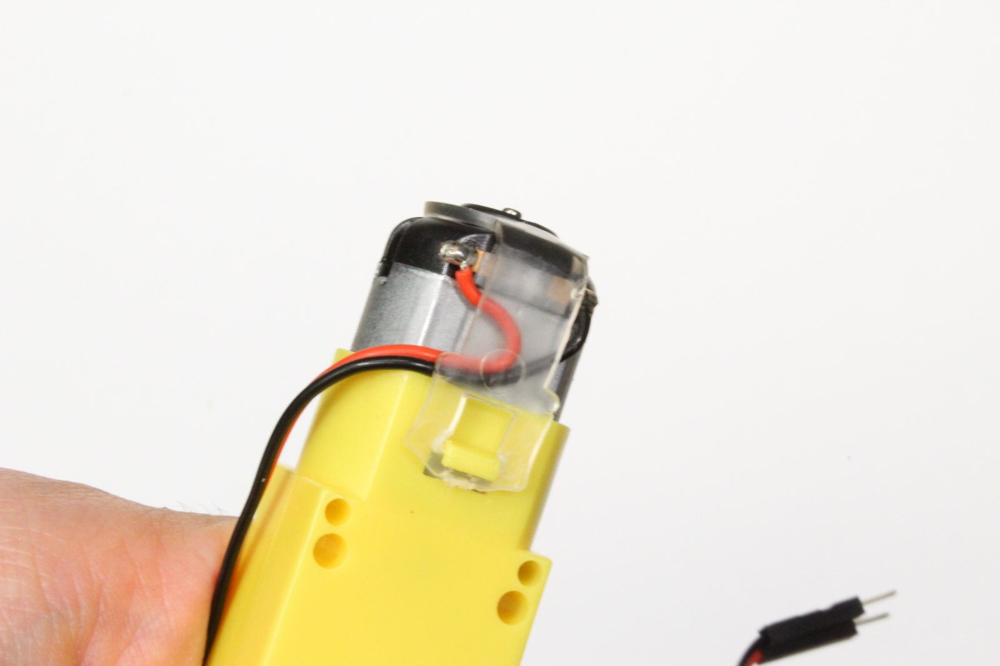
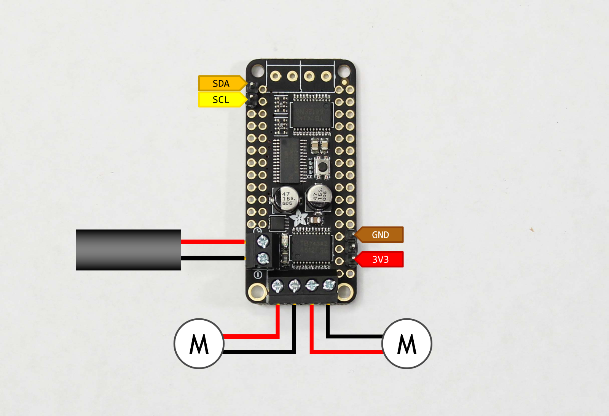

This page details the hardware setup instructions for creating JetBot

## Tools needed

To build JetBot you'll need the following tools

* Pliers
* Wire flush cutters/wire stripper
* Phillips screwdriver (+ Hex screwdriver for M2 hex socket screws)
* Soldering iron and solder
* (optional) [Precision Electronics Tweezers](https://amzn.to/2t4AWg7)

## Assembly

### Step 1 - Clean 3D printed parts

### Step 2 - Mount motors

### Step 3 - Solder motor driver

### Step 4 - Strip motor driver power cable

### Step 5 - Mount motor driver 

