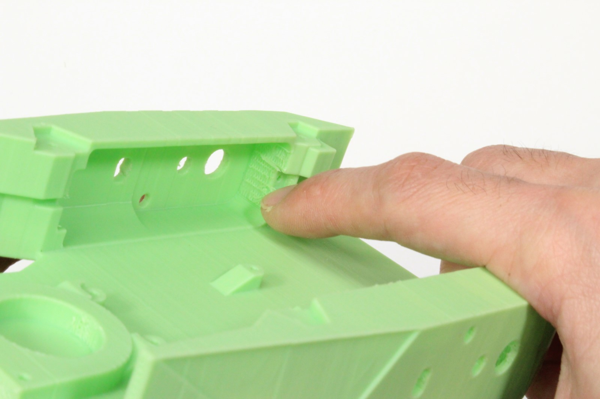
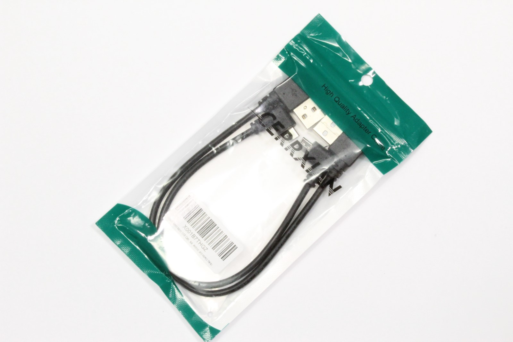
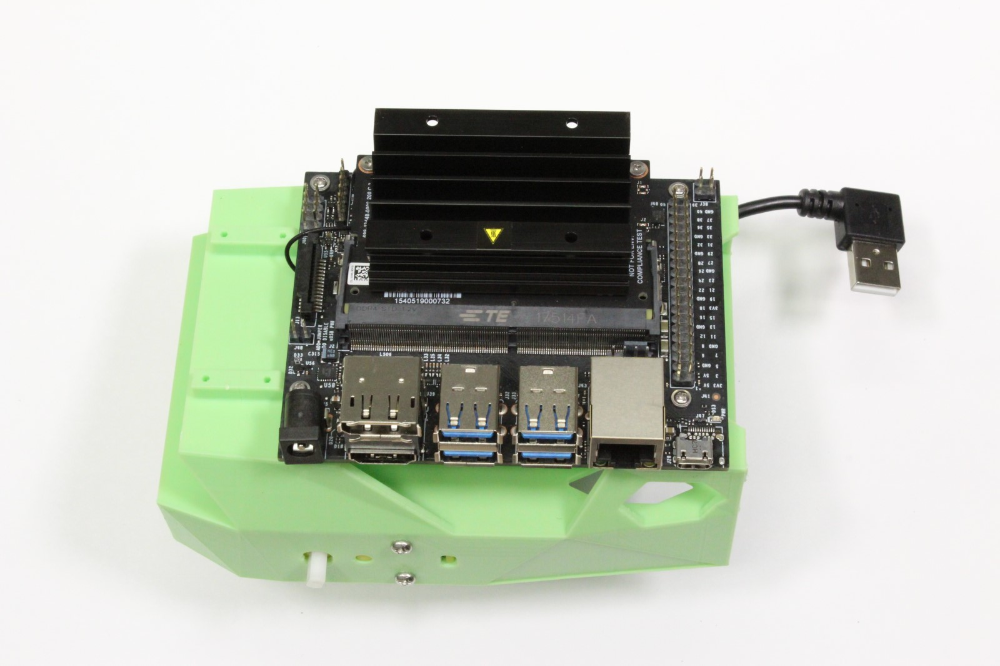
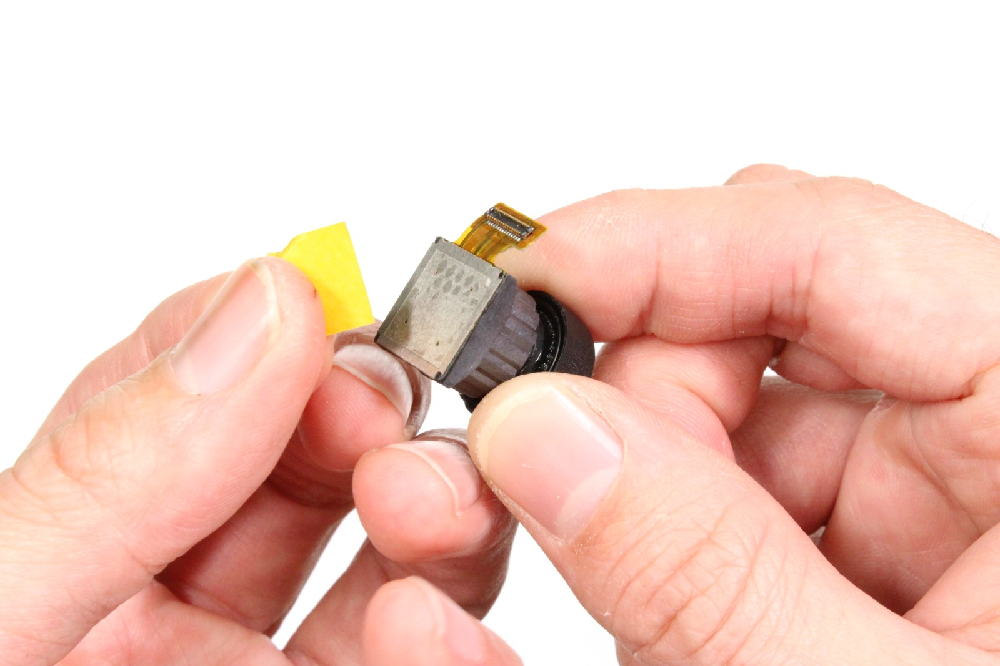
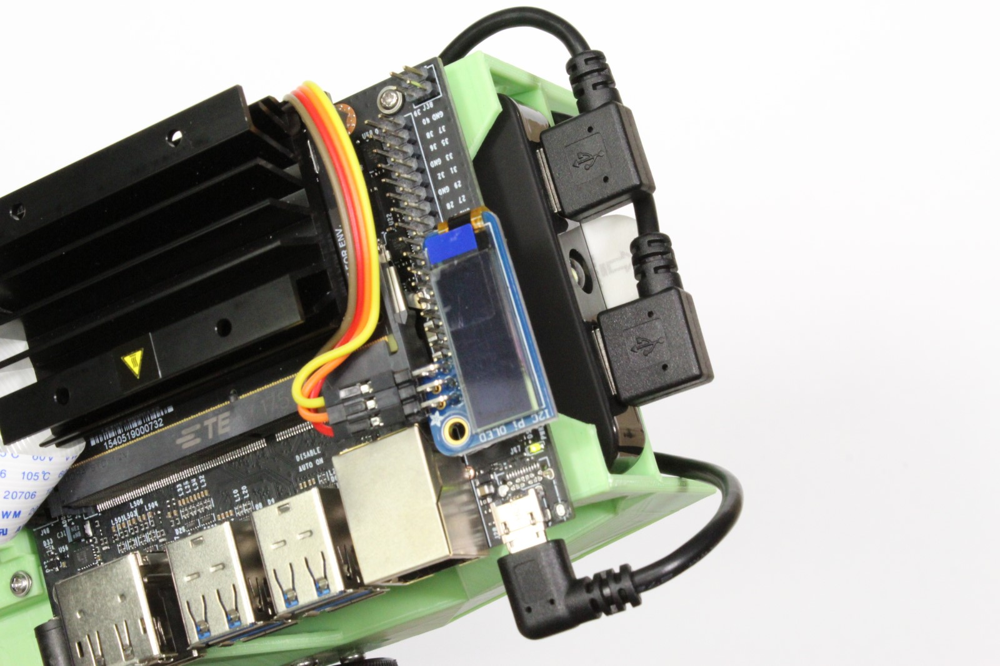

This page details the hardware setup instructions for creating JetBot

## Tools needed

To build JetBot you'll need the following tools

* Pliers

* Wire flush cutters/wire stripper
* Phillips screwdriver (+ Hex screwdriver for M2 hex socket screws)
* Soldering iron and solder
* (optional) [Precision Electronics Tweezers](https://amzn.to/2t4AWg7)

## Assembly

### Step 1 - Clean 3D printed parts

1. Remove support material from motor sockets using pliers

2. Remove support material from all surfaces and openings using pliers, tweezers, and/or fingernails
3. File material from openings if they are too tight

### Step 2 - Mount motors

1. Cut and remove the wire securing zip ties from each motor

2. Tuck the wires beneath transparent band to prevent stress on solder joints
3. Insert each motor into the 3D printed chassis
4. Secure each motor with 2x M3x25mm screws

### Step 3 - Solder motor driver

1. Break away 3pin and 2pin male headers from header link that comes with motor driver package

2. Join two of the screw terminal blocks to create a 4pin screw terminal
3. Solder the 2pin and 4pin screw terminals to motor driver
4. Solder the 2pin and 3pin male headers to motor driver

    > Pay careful attention to the position of the 3pin header.  It is 
    offset by 1pin from the corner.

### Step 4 - Strip motor driver power cable

1. Cut the depicted micro USB cable roughly 8 inches from the type-A terminal

    > Pay careful attention to the image.  The cables are not identical.  The other micro USB cable will be used to power the Jetson Nano.  Using the wrong power cable for Nano will block it's Ethernet port.

2. Strip the rubber coating 1 inch from the cut
3. Remove the green / white wires and metal shielding.
4. Strip the red and black wires about 1/4 inch from cut
5. (optional) Twist the exposed strand wire and coat with solder

### Step 5 - Mount motor driver 

1. Route the spliced cable through chassis

2. Secure exposed red (+) and black (-) wires to screw terminals depicted
    > Pay attention to the markings on the motor driver.  Incorrect wiring could damage the driver.
3. Route the spliced cable under the motor driver to organize and prevent stress on screw terminal
4. Secure motor driver to chassis using self taping screws
5. Secure left and right motor wires to motor screw terminals
    > ***Notice (3/11/2019):*** The red / black wires for the left and right motor are actually flipped in the image.  This will not cause damage, but the motors will spin backwards.

### Step 6 - Mount WiFi antennae 

1. Secure one patch antenna to the underside of top plate

2. Secure the other patch antenna at edge of battery bay
3. Route connectors as shown

### Step 7 - Remove Jetson Nano module from developer kit

1. Remove standoff screws from Jetson Nano module

2. Release the side latches of SODIMM connector using hands

### Step 8 - Attach WiFi module to developer kit

1. Attach developer kit to chassis using self taping screws

2. Attach both antennae to WiFi module using fingers
3. Remove the screw from developer kit by the M.2 socket
4. Insert WiFi module into M.2 slot on developer kit
5. Fasten WiFi module to developer kit with screw removed in (3)
6. Re-attach the Jetson Nano module to developer kit

### Step 9 - Mount ball caster

1. Place the caster ball inside of shroud

2. Insert the caster base into shroud, securing the ball
    > If the socket is too tight, file it some.
3. Attach the assembled caster onto the chassis with self taping screws
    > It will share two screw holes with the motor driver.

### Step 10 - Solder header onto *piOLED* display

1. Secure 6pin right angle header to piOLED by some method

2. Solder the pins depicted (3.3V, SDA, SCL, GND on piOLED)
    > The pins are close to the display screen, be careful to avoid the screen with soldering iron tip

### Step 11 - Wire motor driver to *piOLED* display

1. Select 4 wire segment of female-female jumper cables.
    > We use brown, red, orange, yellow segment.  You can map the colors accordingly.

2. Attach 3.3V (red), GND (brown), SDA (orange), and SCL (yellow) to motor driver as shown
3. Route the 4 wire jumper cable segment through chassis
4. Attach red, brown, orange and yellow wires to right angle header as depicted
   > Pay close attention!  Reversing the red / brown wires could damage the system.

### Step 12 - Mount camera

1. Attach the camera to the camera mount using 4x self tapping screws

2. Attach the camera mount to chassis with 4x self tapping screws
3. Insert the other end of ribbon cable into Jetson Nano developer kit
4. (optional) Tuck the ribbon cable against heat sink to organize

### Step 13 - Attach wide angle sensor

1. Peel off the original camera sensor

2. Remove any excess adhesive material
3. Remove the adhesive film cover from wide angle replacement sensor
4. Attach wide angle replacement sensor to camera module
5. Ensure the sensor connector is fastened to camera module

### Step 14 - Mount battery

1. Attach double sided adhesive tabs to each end of battery, leaving some tab exposed
2. Holding robot upside down, slide battery into battery bay
3. Holding the battery in place, flip the robot and secure battery to chassis

### Step 15 - Organize wires

# Next step

Follow the [software-setup](software-setup) guide.

