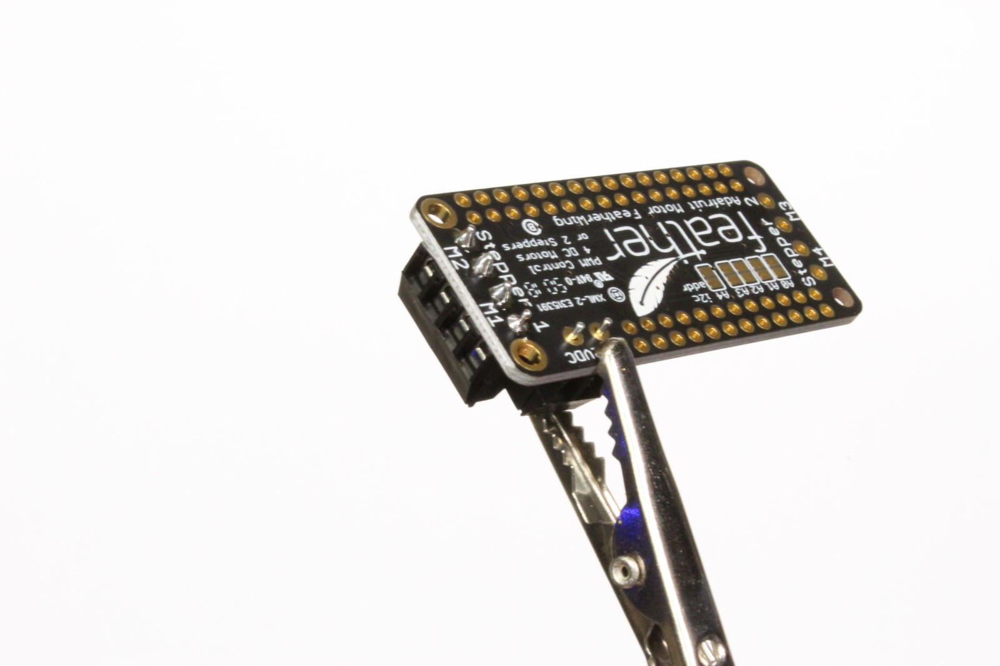
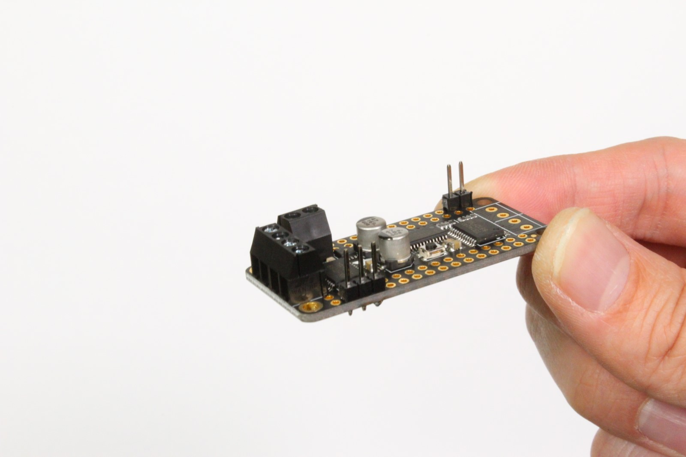
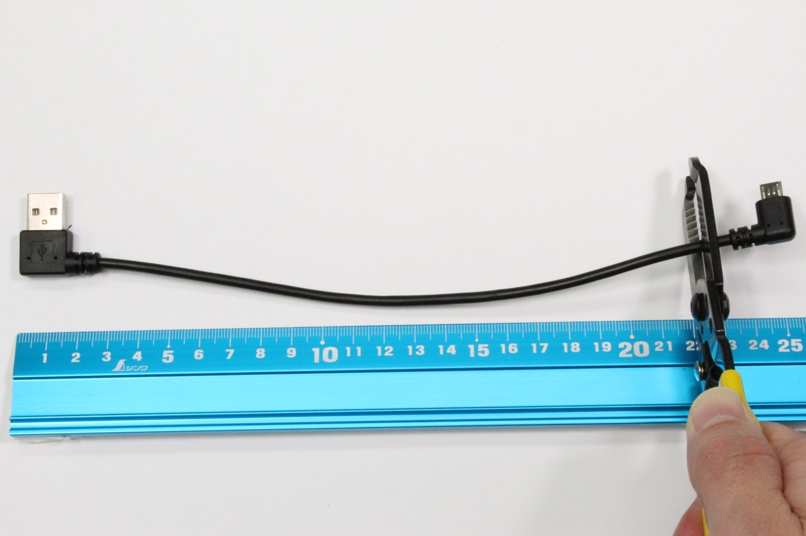
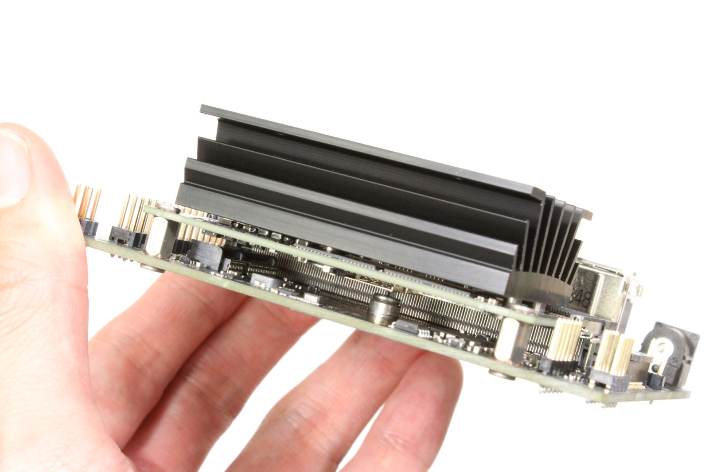
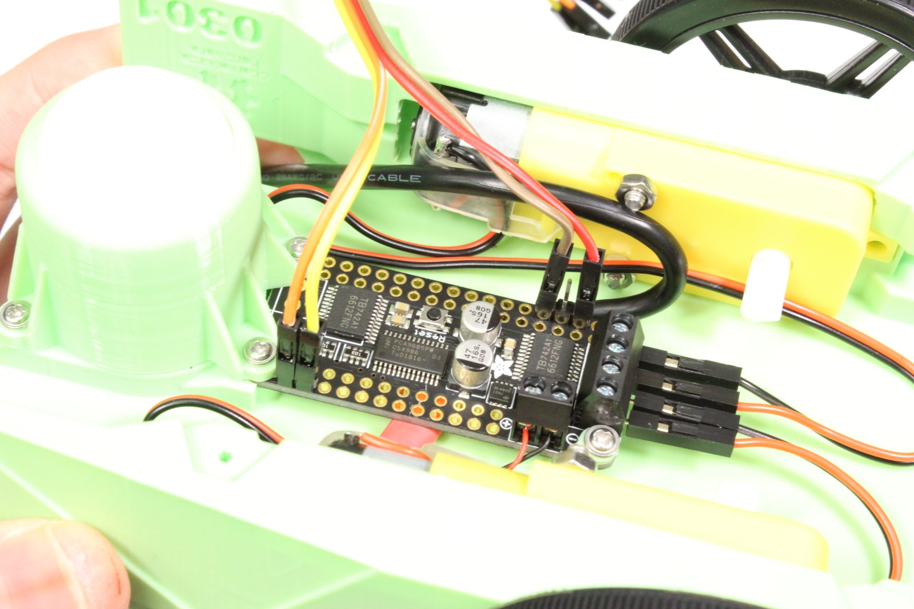

This page details the hardware setup instructions for creating JetBot

## Tools needed

To build JetBot you'll need the following tools

* Pliers

* Wire flush cutters/wire stripper
* Phillips screwdriver (+ Hex screwdriver for M2 hex socket screws)
* Soldering iron and solder
* (optional) [Precision Electronics Tweezers](https://amzn.to/2t4AWg7)

## Assembly

### Step 1 - Clean 3D printed parts

1. Remove support material from motor sockets using pliers

2. Remove support material from all surfaces and openings using pliers, tweezers, and/or fingernails
3. File material from openings if they are too tight

### Step 2 - Mount motors

1. Cut and remove the wire securing zip ties from each motor

2. Tuck the wires beneath transparent band to prevent stress on solder joints
3. Insert each motor into the 3D printed chassis
4. Secure each motor with 2x M3x25mm screws

### Step 3 - Solder motor driver

### Step 4 - Strip motor driver power cable

### Step 5 - Mount motor driver 

### Step 6 - Mount WiFi antennae 

### Step 7 - Remove Jetson Nano module from developer kit

### Step 8 - Attach WiFi module to developer kit

### Step 9 - Mount ball caster

### Step 10 - Solder header onto *piOLED* display

### Step 11 - Wire motor driver to *piOLED* display

### Step 12 - Mount camera

### Step 13 - Attach wide angle sensor

### Step 14 - Mount battery

### Step 15 - Organize wires

# Next step

Follow the [software-setup](software-setup) guide.

