This page details everything needed to assemble your JetBot.  

🛑 _**Big warning!!**_ 🛑 
**Please go through the [Getting Started with Jetson Nano Developer Kit](https://docs.google.com/document/d/1-JJpbVedCQf_nqYcPu4cTmoz3a1-GgSz6seSPA8xBPQ/edit?usp=sharing) first on Jetson Nano Developer Kit alone, before putting Jetson Nano Developer Kit on the robot.  
Please first make sure that your Jetson Nano Developer Kit properly boots by itself with a microSD card that you set up.**

----

# Block Diagram

For reference, this is a high-level diagram detailing the main components of JetBot

# Before you start

## Tools needed

To build JetBot you'll need the following tools

* Pliers
* Wire flush cutters/wire stripper
* Phillips screwdriver (+ Hex screwdriver for M2 hex socket screws)
* Soldering iron and solder
* (optional) [Precision Electronics Tweezers](https://amzn.to/2t4AWg7)

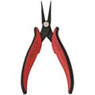

## 3D printing chassis

> We now have a [3D printing wiki page](3d-printing) for 3D printing tips!

We provide a design file (STL file) for the 3D printed chassis in this repository.  You'll need to 3D print this in order to build JetBot

How you decide to print the chassis will depend on what you have available.  If you have a 3D printer on hand, the material cost of the chassis is very low.  If you don't have a 3D printer you could order from an external printing service, which will be more expensive.  

> If you want to print several JetBots you may consider buying a 3D printer, we've tested on a $300 which works well!

# Assembly

> You can click each image below and a bigger image opens up in a new tab/window. Please check the detail.

> When you drive a screw, you want to make sure that you first hold the screw perpendicular to the surface and straight with the hole.

## 01. 3D-printed parts preparation

First, prepare/clean your 3d-printed chassis. 
You need to use pliers and if necessary files to remove supports, brims, and/or rafts or any excess filaments. 
It will depend on your 3d-printer (precisely talking Slicer software ) settings, so check the [STL file](https://gitlab-master.nvidia.com/jwelsh/jetbot/blob/v03-hardware/assets/chassis.stl) to identify all the unnecessary structure that you need to remove.

1. Use pliers to remove a big chunk of support from motor sockets on each side.
2. Remember to remove support on holes on the side.
3. You may need to use tweezers to remove a support in a hole.
4. If neccesary, use a file to remove excess structure
5. You can use your neils to file off filaments residue from the top of motor sockets.

## 02.  Mounting motors

Next, mount DC geared motors on the chassis.

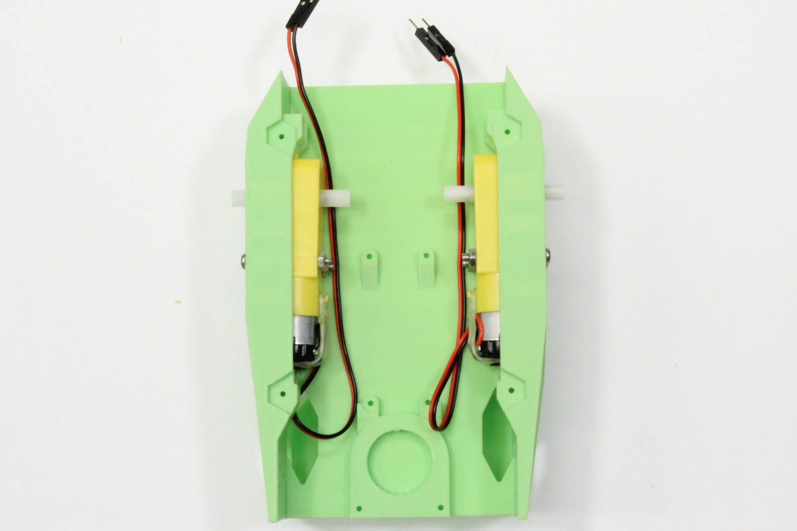

1. Cut the zip tie.
2. It is a good idea to let the wires go under the transparent motor band to prevent pulling pressure on terminals. You'd first need to remove the band and put it back.
3. Let the motor gearboxes slide into the socket.
4. Use M3x25mm screws to fasten the motor gearboxes.
5. It should look like this from the bottom.

## 03. Soldering motor driver

In this step, you first prepare the motor driver board by soldering terminal blocks and header pins. 
The board is later to be wired as depicted in Image #1.

1. The motor driver board is to be wired like this in the later step.
2. Pin headers and terminal blocks are to be wired.

⚠️**Attention:**  _**Many people make a common mistake here. The 3-pin header should NOT go to the very end of the row. It should leave one pad.**_ 

3. Use of a soldering clamp like this make it easy to solder components.
4. When soldering pin headers, pay attention to not melt the plastic base and make the pin loose.
5. It should look like this.  _**Again, note that the 3-pin header leave one pad open on its left.**_ 

## 04. Splicing USB cable for motor driver power

Next you prepare a USB cable to be used as a power cable for the motor driver board.

1. It should come with 2 USB cables in the package. Notice they are not identical, but the Micro USB plug ends are different. You put aside the one that has Micro USB plug that has cable goes to the right facing the port (to not block the Ethernet port).
2. For powering the motor driver board, you want to use the cable with this end of Micro USB plug that has cable goes to the left facing the port/receptacle. (Click to enlarge the photo to check the appropriate Micro USB plug cable.)

⚠️**Attention:**  _**Failure to choose the right cable will result in needing to use undesirable shape/side of Micro USB plug for powering Jetson Nano Developer Kit, which would block its Ethernet port. **_

3. Again, make sure you get the appropriate cable and cut it in 22-23cm (8.5-9 inch) from the Type-A connector side.
4. Strip the end 2.5cm/1-inch of USB cable rubber.
5. Remove the shield wick, aluminum foil, and leave the green (D+) and white (D-) wires aside. Strip the end of red (VBUS) and black (GND) wires for about 3mm.

## 05. Mounting motor driver

Finally, mount the motor driver board, with wires fixed on to it.

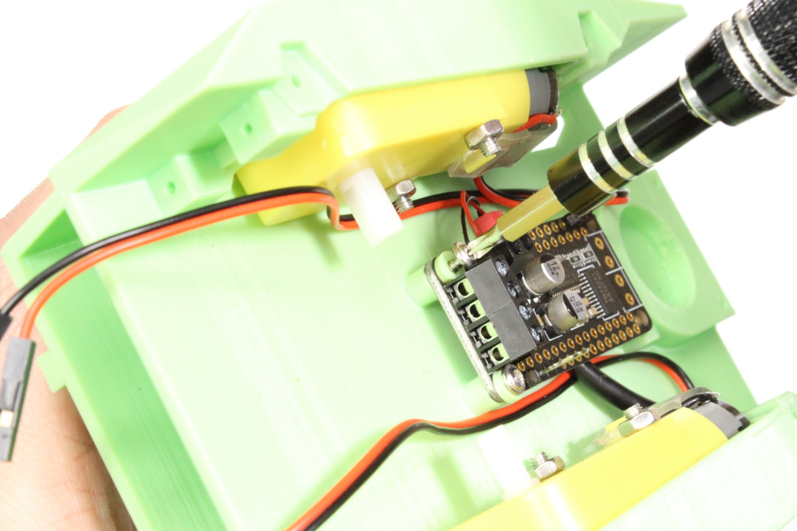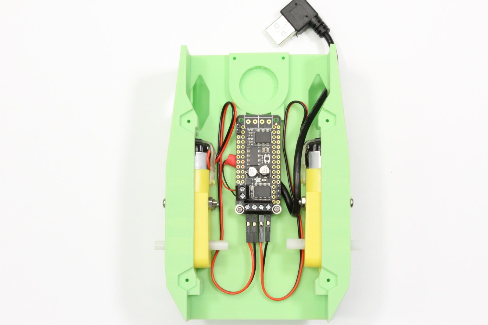

1. Let the prepared power cable (the cut USB cable) go through the access holes to have the red and black wires come to the bottom.
2. With the cable's Type-A connector side hanging thought the access hole, fasten the red and black wires on the terminal blocks for motor driver board power.
3. Let the power/USB cable sit below the board.
4. Leave the upper-end screw holes to screw later with caster shroud. Screw the bottom-end 2 holes of the board with M2x8 self-tapping screws and the 3d-printed spacers.
5. Fasten motor wires on terminal blocks.
6. It should now look like this from the bottom.

## 06. Wi-Fi antenna placement 

To make the antenna wiring easier, first place/paste Wi-Fi antenna patches on the chassis.

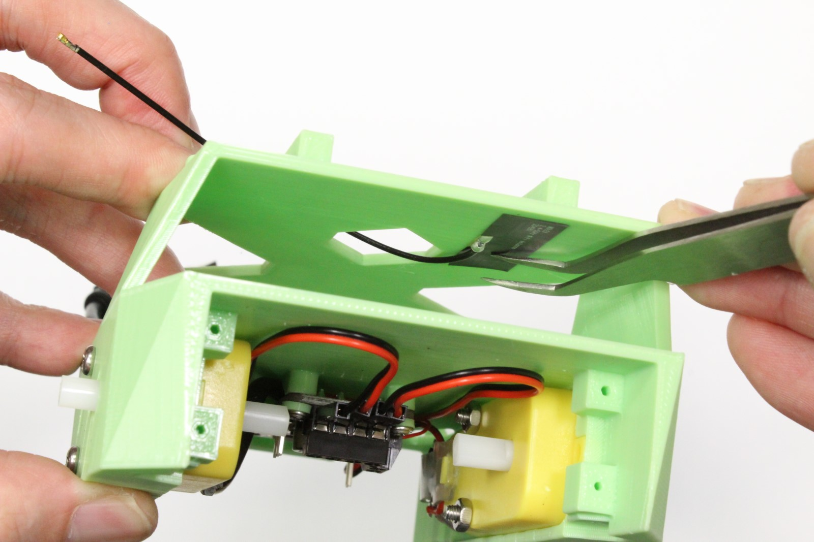

1. In this step, we will work on only the Wi-Fi patch antenna. The M.2 card will come in the next step.
2. One antenna is to be placed here, with the other end/connector going through the access window on the top.
3. Gently use a tweezer to make sure it is firmly pasted on the chassis.
4. The other antenna is to be placed at the side of the battery bay.
5. Again, gently press the patch antenna on the chassis.

## 07. Preparing to mount Wi-Fi card 

Jetson Nano Developer Kit does not have built-in Wi-Fi capability, so we will put M.2 card to enable wireless communication.

1. M.2 socket is located on the top side of the carrier board, underneath the Jetson Nano module.
2. Remove two screws that are holding the Jetson Nano module.
3. Release the side latches of the SODIMM socket using two hands.
4. Jetson Nano module lifts up, and you will find the M.2 socket.

## 08. Mounting Jetson Nano Developer Kit with Wi-Fi card

You screw Jetson Nano Developer Kit down on the chassis with M.2 Wi-Fi card.

1. Use M2x8mm screws to hold Jetson Nano Developer Kit on top of the chassis. Make sure to let the antenna wires come out from the bottom of the carrier board.
2. First, attach the antenna on the M.2 card. Use your fingernail to gently apply press on the connector until you hear/sense the click.
3. Take off the M.2 mounting screw. Pay attention to the different type of screws and keep them separate.
4. Insert the Wi-Fi card into the M.2 scoket, use the right screw to hold in down. Optionally, you can use Kapton tapes to help holding the antenna wires down.
5. Jetson Nano Developer Kit should now be sitting on the chassis like this.
6. Example of antenna cable management.

## 09. Mounting caster

JetBot caster is composed of a 1-inch ball that is made with engineering plastic material which features very low friction, and carefully designed ball base/support and caster shroud. 
Two screws to hold down the shroud also serves as the motor driver mounting screw.

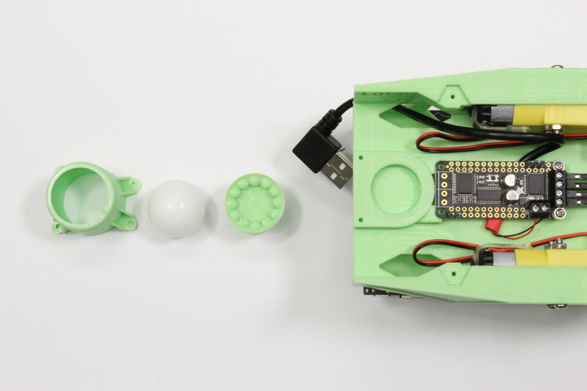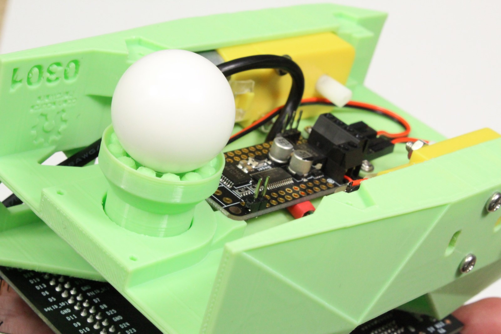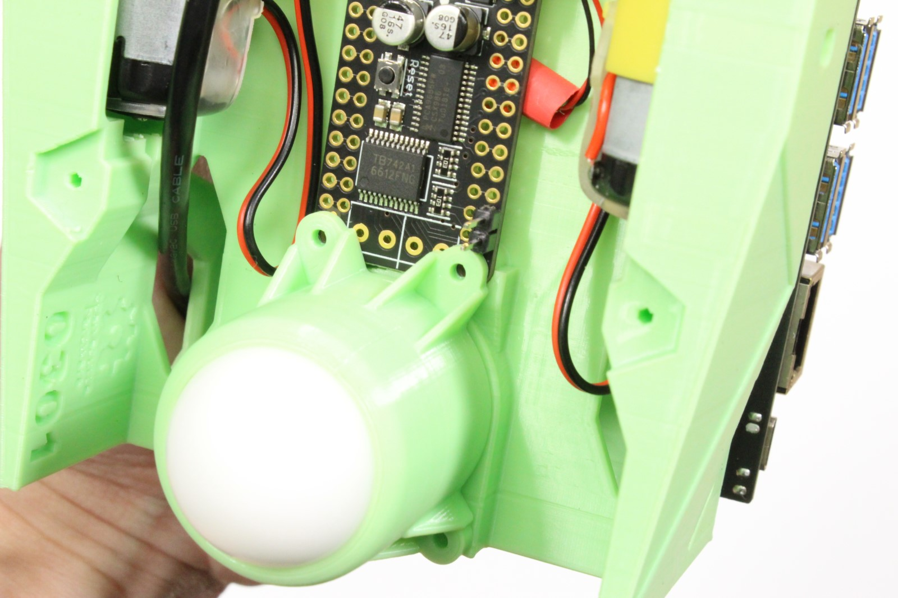

1. From left, caster shroud, ball, base.
2. The narrow side of the base sits in the socket on the chassis. It  supports the ball on the other end.
3. It is a good idea to file off excess materials at the bottom of the caster shroud.
4. Put the ball inside of the caster shroud, and cover that with the ball base. The ball base may be tight, apply pressure carefully.
5. The whole piece goes into the bottom side of the chassis, and will look like this.
6. Use M2-8mm screws to hold the shroud down. Push the ball down to make sure the base goes all the way down to the chassis. The ball now should freely rotates.
7. It should now look like this from the bottom.

## 10. Soldering 6-pin header on PiOLED

PiOLED is going to sit on one end of the 40-pin header of Jetson Nano Developer Kit, but we need to extend the I2C bus there to the motor driver board. 
So we extend the headers from PiOLED pads using the right-angle headers.

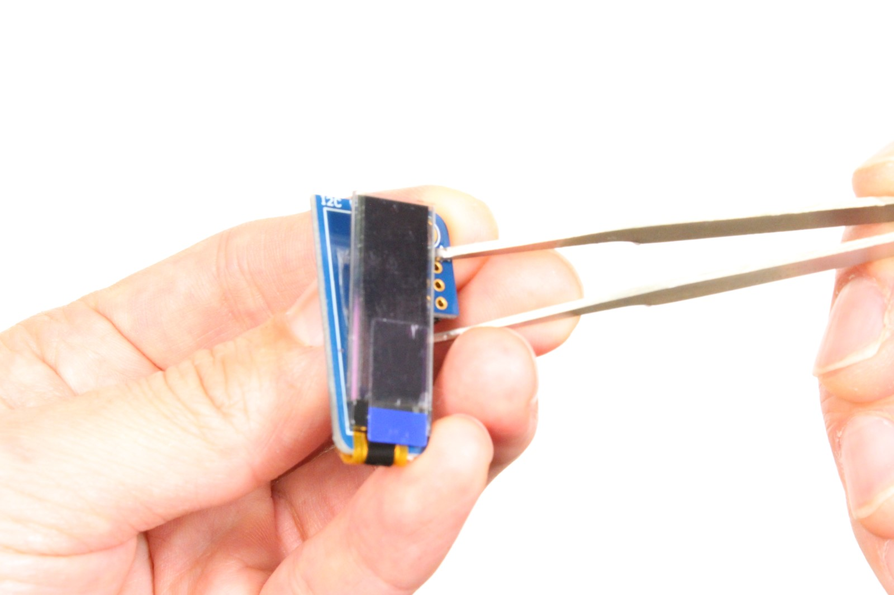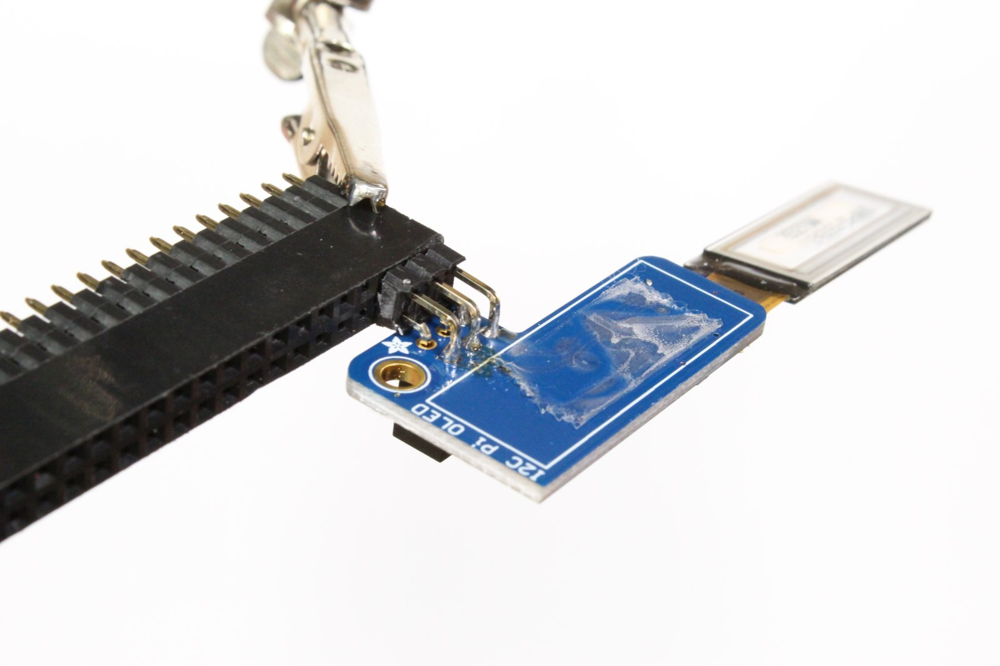

1. If possible lift up the OLED panel from the board of PiOLED. If tightly glued, skip this step.
2. Those colored pins are to be soldered.
3. Leave as much space for reaching the top surface of the board, so your soldering iron tip can touch the 4 pins of 6-pin header.
4. This is who those pins should be soldered.
5. Put the OLED panel back, if you have lifted.

## 11. I2C wiring

We now connect the motor driver board with Jetson Nano Developer Kit. 
You will use a bundle of female-female cables to connect both pin-headers you soldered onto motor driver board and PiOLED.

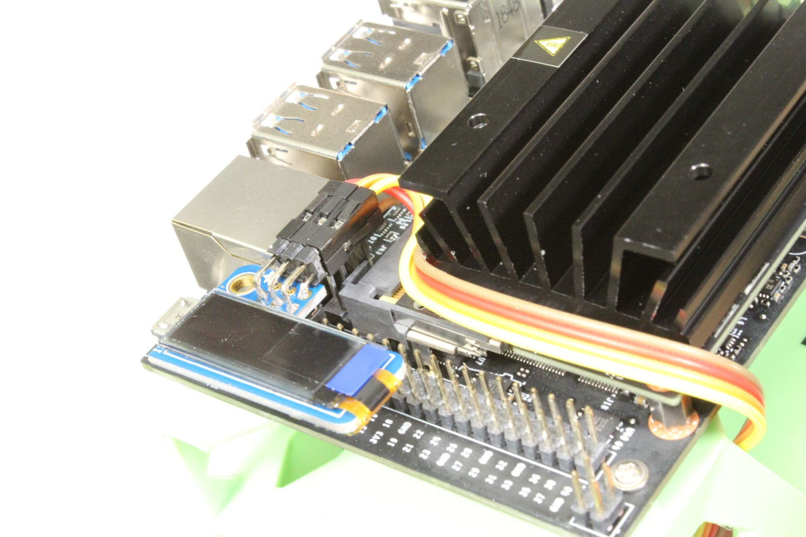

1. Connect 4 cables like this on motor driver board 
2. Notice the red cable (3.3V) is not placed on the very last pad. We correctly did not stuff a pin there.
3. The bundle of cables is routed through the bottom access hole and come out from the side to the top.
4. Cables run along the side of the Jetson Nano module, and places each cable on to the 4 pins.  Notice the brown (GND) cable is right below the yellow cable.
5. Right angle header helps the overall profile low. (by not letting the cable shoot up to the sky)

## 12. Mounting camera

Now put a detachable camera mount on the chassis, with the Raspberry Pi Camera Module v2 board.

1. Screw camera module board on the camera mount piece.
2. Slide the camera mount on the camera mount rail part on the top front part of the chassis.
3. Use another 4 set of screws to fix the camera mount on the chassis.
4. You can tuck the flexible cable as shown.

## 13. Camera lens conversion

We use 160-degree wide angle camera lens "attachment" (really a wide lens piece attached to the IMX219 image sensor) to achieve a wide field of view which is ideal for robotics application.

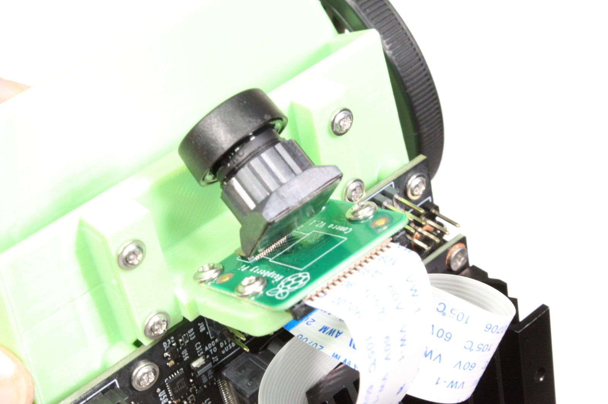

1. Remove the original camera sensor module.
2. Remove the transparent adhesive as well.
3. Peel off the linear from the wide-lens sensor.
4. Attach the sensor connector to the board connector.
5. Apply pressure gently on the connector to make sure the connection.
6. It should now look like this. You need to remove the camera lens cover before use.

## 14. Battery mounting (taping)

You want to secure the heaviest item of the robot firmly on the chassis, and some double-sided adhesive tape will do. 
You can choose to use a removable type if you know you may need to take out the battery pack some point.

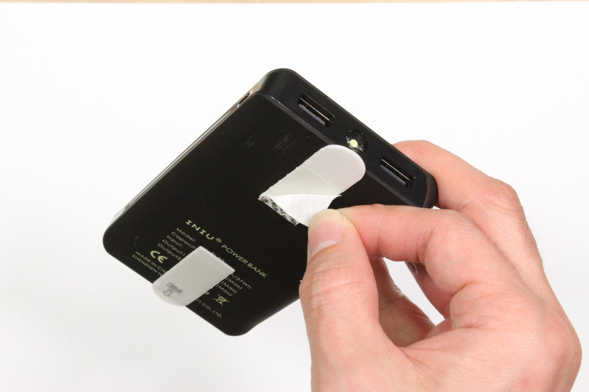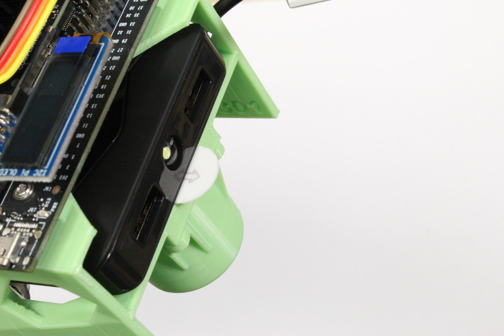

1. Place the removable adhisive tape designed for posters like this under the battery pack.
2. Let the battery slide into the bay like this, paying attention not to let the bottom side touch the chassis. 
At the right location, apply pressure from the top to the battery pack on the chassis so that it is pasted firmly on the bottom of the battery bay.
3. The front should look like this. 
4. The back/tail should look like this.
5. If you need to take out or replace the battery pack, you can pull the tab hard and the whole tape will come off.
6. If you know you will never take out the battery pack from the robot, you can just use patches of a simple double-sided adhesive tape.

## 15. Wire management

Some examples of ways to manage cables.

# Setup

Once you think you are done with assembling your robot, before powering on **DOUBLE / TRIPLE CHECK YOUR WIRING**, JetBot is DIY, which means it's possible to break things.

If you have not booted Jetson Nano Developer Kit by itself before, remove the Jetson Nano Developer Kit from the robot now and first complete the software setup and boot test.

## 16. Boot and setup Wi-Fi

Use the JetBot image to flash the 64GB microSD card. 
Insert the microSD card to the Jetson Nano module's microSD card slot, plug HDMI cable and USB keyboard and mouse cables, and plug the Micro USB cable to finally power your JetBot on. 

1. JetBot boots into desktop.
2. Notice it initially does not have any IP address.
3. You need to operate Ubuntu desktop to connect your JetBot to your wireless network.
4. Once wireless AP registration/connection is done, JetBot IP address is going to show up on the PiOLED display.
5. Now you can remove your HDMI cable, USB keyboard and mouse cables, and let the JetBot go.

# Next step

Now that your robot is all setup, you're ready to program the robot from your desktop's/laptop's web browser!

Once your robot powers up, go ahead and follow the [software setup](software-setup)!

